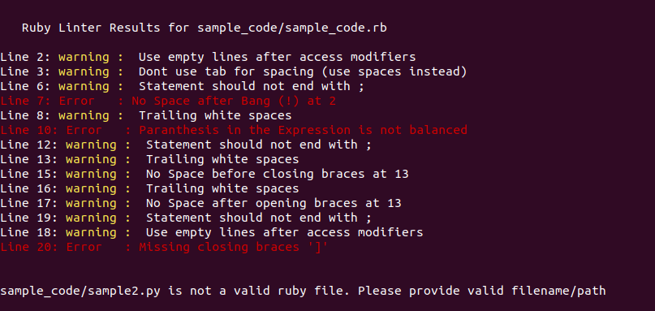

# RB-Linter - Linter for Ruby code

Ruby Linter. This provides feedback about errors and warning in code. As Linter this checks for the Logic and Syntax Errors in the code. The Style Configurations are derived from [Ruby Sytle Guide](https://rubystyle.guide/)

### How to Run the Linter

- Fork/Clone this project to your local machine
- Install dependencies by `bundle instal`
- Run the Linter by `bin/main.rb file_to_check.rb` on command line.

you can check mutliple files at once.

- Run `bin/main.rb file1.rb file2.rb other_file.rb`

# Linter functionalities

This is beginener level linter which monitors and reports limited style and logic issues. It can validate following logic / styles

## Paranthesis balanced in the Expression

Linter validates if the Expression is balanced with paranthesis, if not it will raise an error. It will also reports the missing paranthesis in some cases.

## newline after access modifiers

Validates if new line is provided after specifing access modifiers as (public, private, protected, attr_accessor, attr_reader, attr_writer)

### good

private

def method
end

### bad

private
def method
end

## check no space after !

Linter throws an error if there is space after bang/exclaimatory (!)

### good

!something

### bad

! something

## Report extra line breaks

Linter reports Two or More Empty Lines occuring continuously.

## check for space after and before braces

The opening and closing braces ( '()' and '[]' ) should not have spaces between

### good

some(arg).other
var = [1, 2, 3]

### bad

some( arg ).other
var = [ 1, 2, 3 ]

## The RB-Linter also checks for following style rules

- Should'nt use tab for spacing (use spaces instead)
- Statement should not end with semicolon ';'
- Limit lines to 80 characters (use '/' to extend line)
- Extra Trailing white spaces

### As a professional Linter, this also excludes the string text while checking for the style and logic errors. The Linter designed and developed with considering running time and space complexity as one of main aspects. the code file is almost processed single scan ~ O(n+k).

## Built With

- Ruby
- RSpec
- Rubocop

## Author

👤 **Karthick**

- Github: https://github.com/karthi07

## 🤝 Contributing

Contributions, issues and feature requests are welcome!

Start by:

- Forking the project
- Cloning the project to your local machine
- `cd` into the project directory
- Run `git checkout -b your-branch-name`
- Make your contributions
- Add and Run test `rspec`
- Push your branch up to your forked repository
- Open a Pull Request with a detailed description to the development(or master if not available) branch of the original project for a review

## Show your support

Give a ⭐️ if you like this project!

## Acknowledgments

- https://rubystyle.guide/
